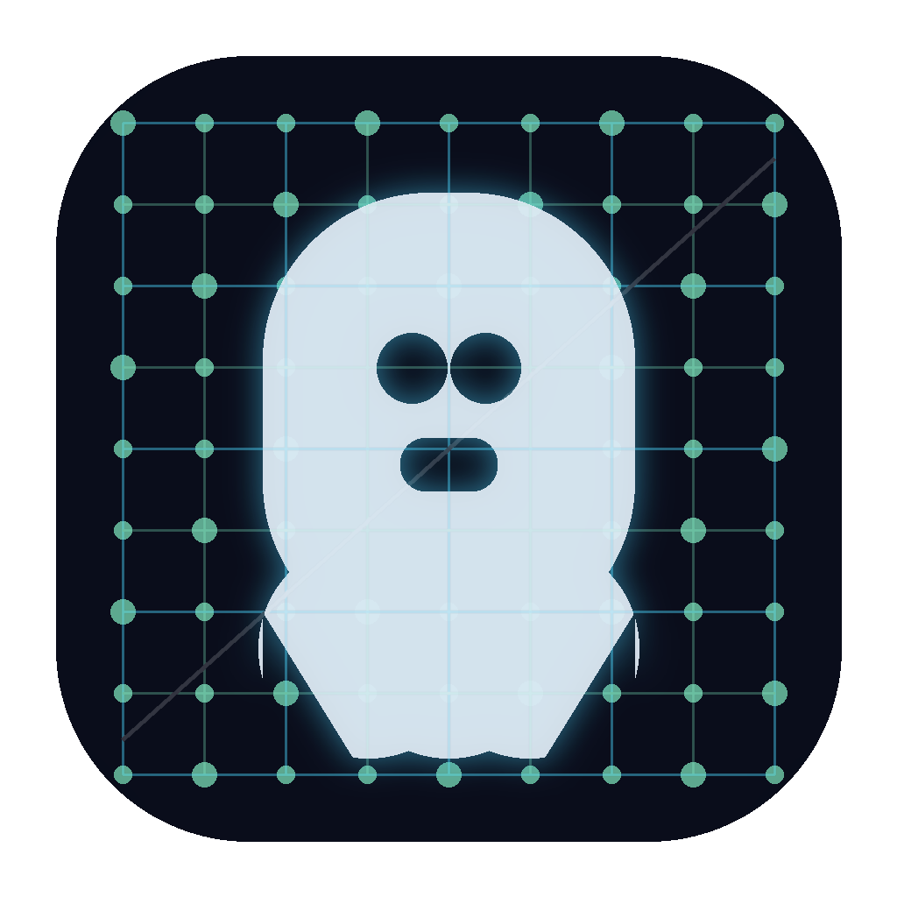

# GridGhost 👻

GridGhost is a lightweight, high-performance Modbus (and soon BACnet) device simulator designed for BMS (Building Management System) testing, commissioning, and development. It allows engineers to simulate complex field devices with dynamic data generators without physical hardware.



## Features

- **Multi-Protocol Support**: Modbus TCP (Fully implemented), BACnet (Roadmap).
- **Direct Store Integration**: No polling loops. Modbus registers map directly to the internal simulation store for real-time reactivity.
- **Dynamic Data Generators**:
  - **Sine Wave**: Perfect for temperature and CO2 simulation.
  - **Ramp**: For testing high/low alarms.
  - **Random**: For simulating sensor noise.
  - **Static**: For manual command/status testing.
- **Template System**: Quickly create devices from JSON templates (Energy Meters, AHUs, VAVs, etc.).
- **Editable Device Config**: Change ports and point types on the fly (requires stop/start for stability).
- **Modern UI**: Dark-themed, responsive Avalonia UI.

## Tech Stack

- **Framework**: .NET 8, Avalonia UI
- **Protocols**: NModbus4
- **MVVM**: CommunityToolkit.Mvvm

## Roadmap 🗺️

### Phase 1: Core & Modbus (Completed)
- [x] Basic Simulation Engine.
- [x] Modbus TCP Server implementation.
- [x] Template-based device instantiation.
- [x] Direct binding loop-free architecture.

### Phase 2: Persistence & Usability (Next)
- [ ] **Project Save/Load**: Persist your workspace configuration to `.ggproj` files.
- [ ] **Custom Templates UI**: A proper visual editor for creating and modifying templates within the app.
- [ ] **Log Export**: Save simulation logs to CSV/Text for analysis.

### Phase 3: BACnet & Advanced Simulation
- [ ] **BACnet/IP Support**: Full implementation of a simulated BACnet stack.
- [ ] **Scripting Engine**: Use C# or Python scripts to define complex point dependencies (e.g., if Pump is ON, Flow increases).
- [ ] **Web Dashboard**: Remote monitor for the running simulation.

## Building and Running

### Prerequisites
- .NET 8 SDK

### Running from source
```bash
dotnet run --project DeviceSim/DeviceSim.App/DeviceSim.App.csproj
```

### Creating the Executable
To generate a single-file executable for Windows:
```powershell
dotnet publish -c Release -r win-x64 --self-contained true -p:PublishSingleFile=true -p:IncludeNativeLibrariesForSelfExtract=true
```

## License

Licensed under the [Apache License, Version 2.0](LICENSE).

---
*Created with ❤️ for the BMS community.*
